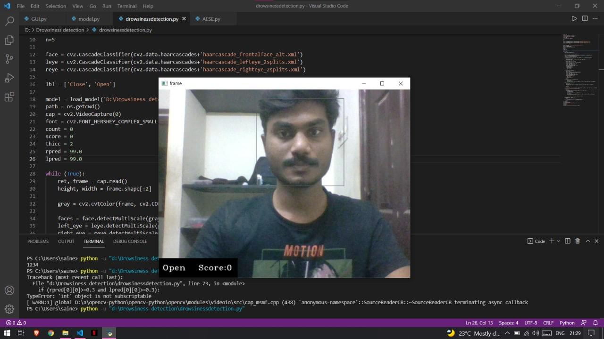
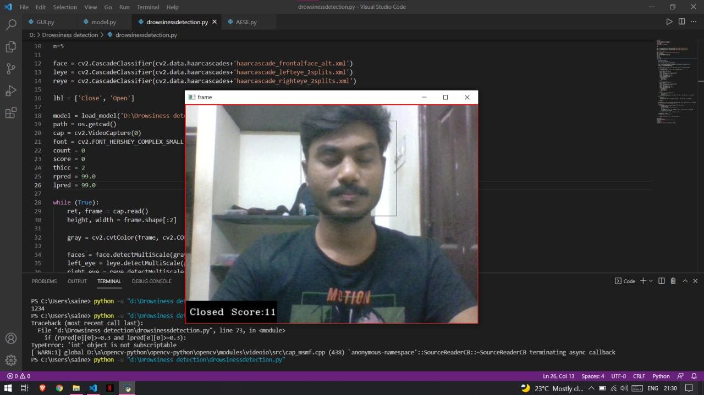
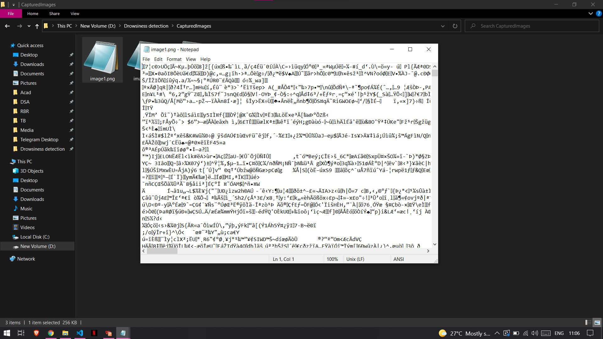

# Drowsiness detection and Encryption of Results

## **Problem Statement :**

To monitor students during the online class sessions, detect drowsiness and encrypt the captured images.

## **Steps involved in Drowsiness Detection :**
  - Take image as input from a camera.
  - Detect the face in the image and create a Region of Interest (ROI).
  - Detect the eyes from ROI and feed it to the classifier.
  - Classifier will categorize whether eyes are open or closed.
  - Calculate score to check whether the person is drowsy.
  - If the score exceeds the threshold, we capture the face.
  
  
## **Steps involved in AES Encryption :**
  - Byte substitution.
  - Shift rows. 
  - Mix columns.
  - Add round key.

## **Working :**

**Drowsiness Detection :**

**File after encryption :**

Please go through the Presentation.pdf file for complete presentation.
